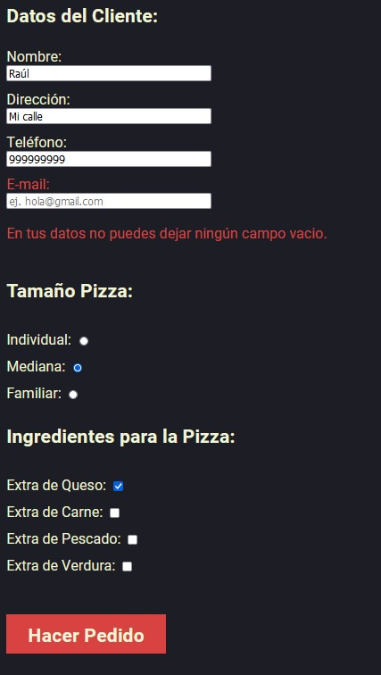
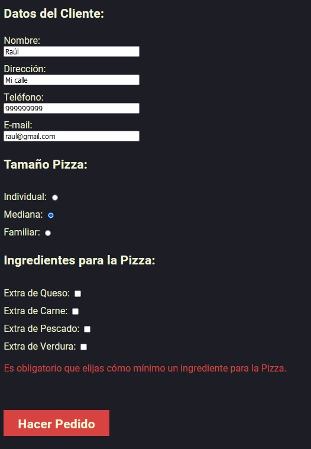
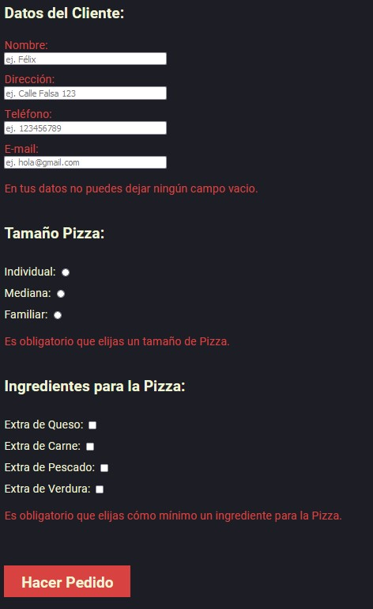

## Para mostrar el correcto funcionamiento de la página, se ha decidio alojar la web en un hosting de internet para poder acceder al siguiente dominio:   [https://ae1dwec.pavlokumargfx.com/](https://ae1dwec.pavlokumargfx.com/)  

>## Actividad AE-1. DOM y Formularios  - Grupo 01 (Pavlo Dudnyk y Raúl Herrera).

### Índice:
---
* Distribución del Trabajo en Equipo.
* Estructura del proyecto.
* Contenido de index.html
* Contenido de req1.html
* Contenido de req2.html
* Posibles errores
---
>## Distribución del Trabajo en Equipo.

El trabajo ha sido realizado de manera colaborativa, realizando una primera reunión para la planificación de trabajo, donde se decidió que ambos realizaramos el trabajo por separado con el fin de poder aprender mejor los conceptos aprendidos en clase. Durante el desarrolo de la actividad hemos mantenido reuniones para aclarar dudas que nos han ido surviendo en el avance de la actividad. 

Una vez finalizado los trabajos por separado, mantubimos una reunión final donde se decidió qué contenido presentaríamos. decidimos presentar el trabajo de Pavlo por su diseño y funcionalidad. También se decidió que Raúl se encargara de realizar el documento readme.md en lugar de un documento .PDF

>## Estructura del proyecto.

* **req1:** Contiente los archivos necesarios para el requerimiento 1
    * **js:** Contine los ficheros .js necesarios para generar los elementos necesarios para el requerimiento 2 a través del DOM.
        * **checkbox.js:** Se crean los elementos del checkbox a través del DOM
        * **formulario.js:** Se crean los elementos del formulario a través del DOM 
        * **imagenes.js:** Se crean los elementos del imagenes a través del DOM
        * **radioInputs1.js:** Se crean los elementos del radioInputs1 a través del DOM
        * **radioInputs2.js:** Se crean los elementos del radioInputs2 a través del DOM
        * **select.js:** Se crean los elementos del select a través del DOM
        * **textArea.js:** Se crean los elementos del textArea a través del DOM
* **req2:** Contiente los archivos necesarios para el requerimiento 2
* **index.html:** Es la página de inicio desde donde se puede acceder a los dos requerimientos y al repositorio.
* **style.css:** Contiene el estilo global para los documentos html
---
>## Contenido de index.html 

Es la página de inicio desde donde se puede acceder a los dos requerimientos y al repositorio. 
A continuación, se puede ver la captura  

>## Contenido de req1.html

Muestra la página del formulario con los elementos del requerimiento 1.  
A continuación, se puede ver la captura 

---
>## Contenido de req2.html
Muestra la página del formulario con los elementos del requerimiento 2. 
A continuación, se puede ver la captura 

A continuación, se muestra capturas del proceso realizar el pedido, donde se rellenan los datos y se pulsa el botón de Hacer Pedido:

En la siguiente captura se puede apreciar el mensaje que recibe el usuario cuando realiza el pedido con todos los campos rellenos.

---
>## Posibles errores
Se ha depurado el código para que verifique los campos u opciones vacios. En caso de estar alguno vacío mostrará un mensaje en rojo con las indicaciones correspondientes. A continuación se mostrarán varios ejemplos.

En la siguiente captura se puede apreciar el mensaje que indica cuando falta por rellenar algún campo, marcando en rojo el texto del campo que falta (En este caso E-mail):

En la siguiente captura se puede apreciar el mensaje que indica cuando no se ha activado ningún checkbox de ingredientes:

Por último, se muestra la siguiente captura donde se puede apreciar los diferentes mensajes que muestran cuando no se rellena ningún campo, no se activa ningún tamaño y ningún ingrediente:

---
>## Grupo compuesto por:

* [Raúl Herrera](https://www.linkedin.com/in/raúl-herrera-gil/)
* [Pavlo Dudnyk](https://www.linkedin.com/in/pavlo-dudnyk/)

---

>## Iniciativa del **proyecto**.

#### Trabajo realizado por **Grupo 01** para el proyecto **AE-1. DOM y Formularios**  de la asignatura ***Desarrollo de aplicaciones web entorno cliente*** para el profesor **Félix de Pablo**.